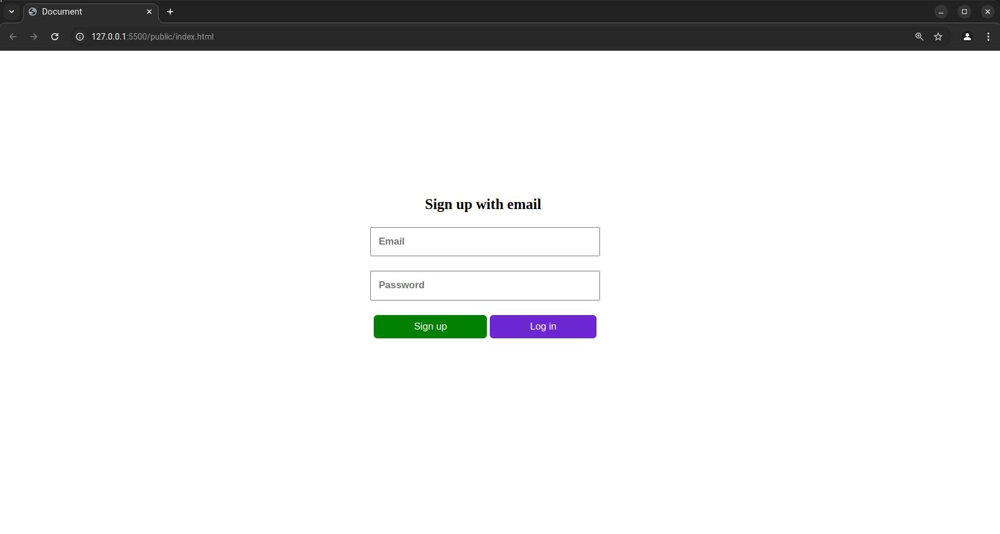
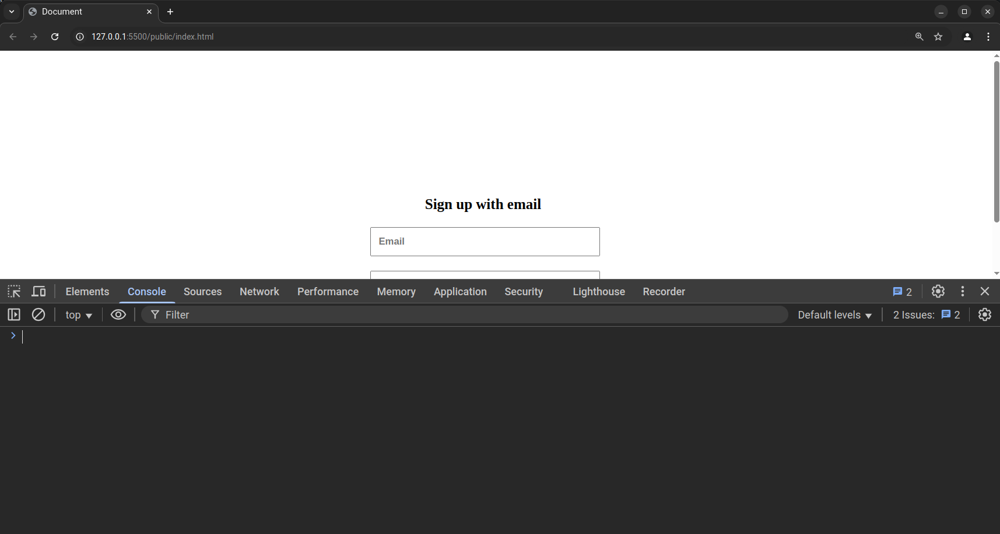
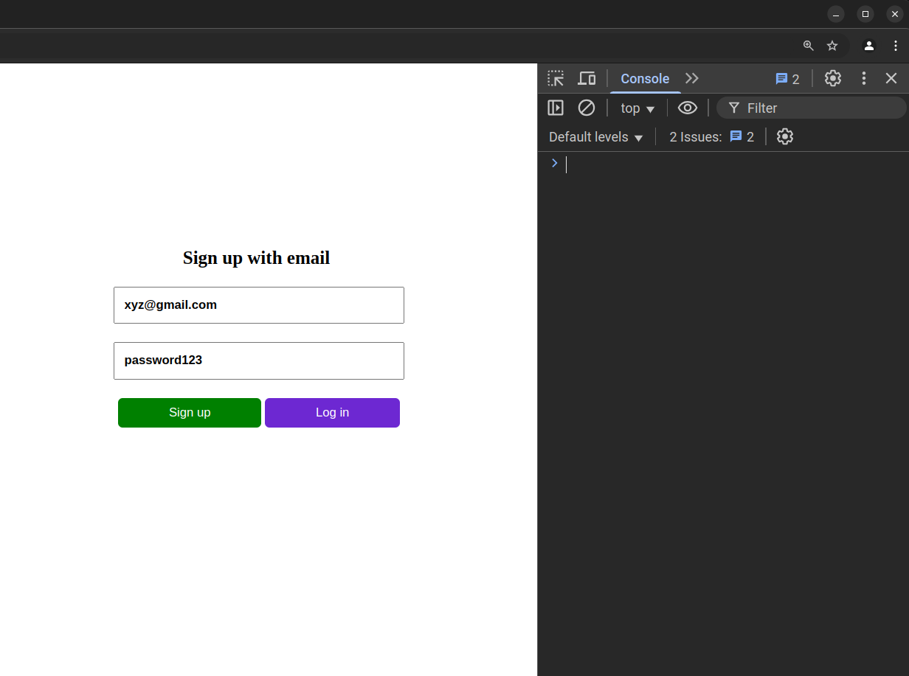
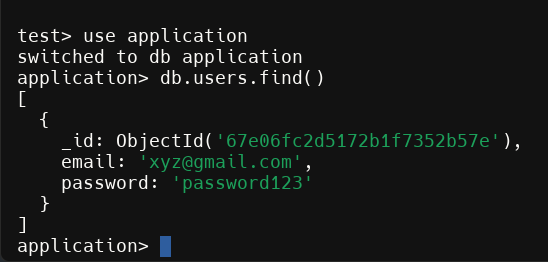

# Python and PyMongo Demonstration

This repository contains the materials and code for the session on "Python & PyMongo (MongoDB driver)" conducted at KKWIEER, Nashik on March 25, 26 & 27th, 2025.

## Overview

The session was a practical guide on MongoDB Python driver PyMongo connectivity with Python using FastAPI.

## Prerequisities

- Python 3.8 or higher

## Setup Instructions

Make sure you have MongoDB installed on your system

Install here: [MongoDB Installation](https://www.mongodb.com/docs/manual/tutorial/install-mongodb-on-ubuntu/)

1. Clone the repository
    ```
    git clone https://github.com/fossKKW/mongodb-session.git
    ```

2. Create a virtual environment & install the dependencies
    ```
    python -m venv venv
    source venv/bin/activate
    ```
    
    ```
    pip install -r requirements.txt
    ```

## Check the project structure


```
public/
    ├── css/
    │   └── styles.css
    ├── js/
    │   └── scripts.js
    ├── index.html
    └── login.html
src/
    ├── database.py
    ├── user_routes.py
.gitignore
readme.md
```

## Hands On

Go to `public/index.html` and open it in your browser. You should see something like this 



Now the next thing to do is to open the terminal in your code editor and run the following command to start the fastapi server.

    
    fastapi dev ./src/user_routes.py 

Go to you [localhost](http://127.0.0.1:8000) & you should a *Hello, World!* message there.
    

Open the console (right click on the page and select the inspect option. Then go the console). It should look something like this.



Enter a dummy email & password in the fields and click sign up



Now you should a see a blank page with a *Login Successful* message. Till this point we have started our FastAPI server, enter your dummy credentials into the sign up or login in page.

Now open up your terminal & check the users collection in application database you should a document like below




